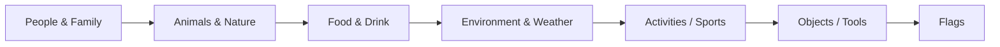

[](https://github.com/firstcontributions/open-source-badges)
[](https://opensource.org/licenses/MIT)
# Ultimate Markdown + Emoji Guide

### 🚀 Purpose

A complete reference for **GitHub-flavored Markdown** + **Full Emoji usage cheat-sheet**.

---

## 📌 Table of Contents

1. Text Formatting
2. Headings & Horizontal Rules
3. Lists & Task Lists
4. Quotes & Code Blocks
5. Tables
6. Emojis All Categories
7. Examples Section
8. Mermaid Diagrams
9. Badges & Light/Dark Mode

---

## 1️⃣ Text Formatting

| Syntax                   | Output            | Notes          |
| ------------------------ | ----------------- | -------------- |
| `*italic*` or `_italic_` | *italic*          |                |
| `**bold**` or `__bold__` | **bold**          |                |
| `***bold italic***`      | ***bold italic*** |                |
| `~~strikethrough~~`      | ~~strikethrough~~ |                |
| `` `inline code` ``      | `inline code`     |                |
| `<u>underline</u>`       | <u>underline</u>  | HTML supported |
| `> quote`                | Quote block       |                |

---

## 2️⃣ Headings

| Syntax      | Output    | Notes           |
| ----------- | --------- | --------------- |
| `# H1`      | # H1      | Largest heading |
| `## H2`     | ## H2     | Second largest  |
| `### H3`    | ### H3    | Medium          |
| `#### H4`   | #### H4   | Small           |
| `##### H5`  | ##### H5  | Smaller         |
| `###### H6` | ###### H6 | Smallest        |

> 💡 **Tip:** Use headings for hierarchy. H1 usually for page title, H2 for sections, H3 for subsections.

---

## 3️⃣ Horizontal Rules

```
---
***
___
```

---

## 4️⃣ Lists & Task Lists

### 🔹 Unordered List

```
- Item A
  - Sub Item A1
* Item B
```

### 🔹 Ordered List

```
1. First
2. Second
```

### 🔹 Task List

```
- [x] Completed
- [ ] Pending
```

---

## 5️⃣ Code Blocks

````
```language
code here
```
````

Example:

```python
print("Hello World")
```

---

## 6️⃣ Tables

| Name | Age | City |
| ---- | --- | ---- |
| Name | Age | City |

---

## 7️⃣ Emojis All Categories

> Use **`:shortcode:`** to display emoji in preview or copy-paste emoji directly.

### 😄 Face Smiling

<details><summary>Show</summary>

| Emoji | Shortcode                    | Emoji | Shortcode            |
| ----- | ---------------------------- | ----- | -------------------- |
| 😀    | `:grinning:`                 | 😃    | `:smiley:`           |
| 😄    | `:smile:`                    | 😁    | `:grin:`             |
| 😆    | `:laughing:` / `:satisfied:` | 😅    | `:sweat_smile:`      |
| 🤣    | `:rofl:`                     | 😂    | `:joy:`              |
| 🙂    | `:slightly_smiling_face:`    | 🙃    | `:upside_down_face:` |
| 😉    | `:wink:`                     | 😊    | `:blush:`            |
| 😇    | `:innocent:`                 |       |                      |

</details>

### 🧑 People & Family

<details><summary>Show</summary>

| Emoji | Shortcode          | Emoji | Shortcode                |
| ----- | ------------------ | ----- | ------------------------ |
| 🧑    | `:person:`         | 👨    | `:man:`                  |
| 👩    | `:woman:`          | 👶    | `:baby:`                 |
| 🧓    | `:older_adult:`    | 👵    | `:older_woman:`          |
| 🧔    | `:bearded_person:` | 🧕    | `:woman_with_headscarf:` |

</details>

### 🐶 Animals & Nature

<details><summary>Show</summary>

| Emoji | Shortcode  | Emoji | Shortcode      |
| ----- | ---------- | ----- | -------------- |
| 🐶    | `:dog:`    | 🐱    | `:cat:`        |
| 🐭    | `:mouse:`  | 🐹    | `:hamster:`    |
| 🐰    | `:rabbit:` | 🦊    | `:fox:`        |
| 🐻    | `:bear:`   | 🐼    | `:panda_face:` |

</details>

### 🍔 Food & Drink

<details><summary>Show</summary>

| Emoji | Shortcode    | Emoji | Shortcode      |
| ----- | ------------ | ----- | -------------- |
| 🍎    | `:apple:`    | 🍌    | `:banana:`     |
| 🍕    | `:pizza:`    | 🍔    | `:hamburger:`  |
| 🍩    | `:doughnut:` | 🍪    | `:cookie:`     |
| 🍺    | `:beer:`     | 🍷    | `:wine_glass:` |

</details>

### 🌳 Environment / Weather

<details><summary>Show</summary>

| Emoji | Shortcode          | Emoji | Shortcode          |
| ----- | ------------------ | ----- | ------------------ |
| ☀️    | `:sun:`            | 🌙    | `:moon:`           |
| 🌧️   | `:cloud_rain:`     | 🌨️   | `:cloud_snow:`     |
| 🌲    | `:evergreen_tree:` | 🌳    | `:deciduous_tree:` |
| 🌻    | `:sunflower:`      | 🌸    | `:cherry_blossom:` |

</details>

### 🏆 Activities / Sports

<details><summary>Show</summary>

| Emoji | Shortcode    | Emoji | Shortcode             |
| ----- | ------------ | ----- | --------------------- |
| ⚽     | `:soccer:`   | 🏀    | `:basketball:`        |
| 🏈    | `:football:` | 🎾    | `:tennis:`            |
| 🏊    | `:swimming:` | 🏋️   | `:weight_lifter:`     |
| 🏌️   | `:golfing:`  | ⛹️    | `:basketball_player:` |

</details>

### 💡 Objects / Tools

<details><summary>Show</summary>

| Emoji | Shortcode    | Emoji | Shortcode   |
| ----- | ------------ | ----- | ----------- |
| 💻    | `:computer:` | 🖥️   | `:desktop:` |
| ⌨️    | `:keyboard:` | 🖱️   | `:mouse:`   |
| 🖊️   | `:pen:`      | 📝    | `:memo:`    |
| 🔧    | `:wrench:`   | 🔒    | `:lock:`    |

</details>

### 🚩 Flags

<details><summary>Show</summary>

| Emoji | Shortcode   | Emoji | Shortcode   |
| ----- | ----------- | ----- | ----------- |
| 🇺🇸  | `:flag_us:` | 🇮🇳  | `:flag_in:` |
| 🇬🇧  | `:flag_gb:` | 🇨🇦  | `:flag_ca:` |
| 🇯🇵  | `:flag_jp:` | 🇰🇷  | `:flag_kr:` |
| 🇩🇪  | `:flag_de:` | 🇫🇷  | `:flag_fr:` |

</details>

---

## 🧪 Examples

```md
# My Project Title ✨

## Features 🚀
- Blazing fast ⚡
- Beautiful UI 🎨
- Open source 💙
- Used Emojis `:grinning:` `:smile:` `:dog:` `:pizza:`
```

---

## Mermaid Diagrams



---

## Badges & Light/Dark Mode


> 💡 **Tip:** GitHub README renders well in both **light** and **dark** modes.

---

## 📌 Notes

* Use `<details>` to collapse sections for cleaner view.
* Copy emoji with `:shortcode:` (backticks used) to **show shortcode in preview**.
