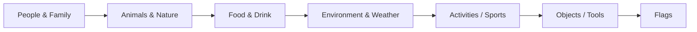

Example:

```python
print("Hello World")
```

---

## 6️⃣ Tables

| Name | Age | City    |
| ---- | --- | ------- |
| Raju | 20  | Kolkata |

---

## 6️⃣ Emojis All Categories

> Use format `:shortcode:` or 🧠 copy‑paste emoji  

### 😄 Face Smiling
<details><summary>Show</summary>

| Emoji | Shortcode                  | Emoji | Shortcode            |
| ----- | -------------------------- | ----- | -------------------- |
| 😀    | :grinning:                 | 😃    | :smiley:             |
| 😄    | :smile:                    | 😁    | :grin:               |
| 😆    | :laughing: / :satisfied:   | 😅    | :sweat_smile:        |
| 🤣    | :rofl:                     | 😂    | :joy:                |
| 🙂    | :slightly_smiling_face:    | 🙃    | :upside_down_face:   |
| 😉    | :wink:                     | 😊    | :blush:              |
| 😇    | :innocent:                 |       |                      |

</details>

### 🧑 People & Family
<details><summary>Show</summary>

| Emoji | Shortcode | Emoji | Shortcode |
| ----- | --------- | ----- | --------- |
| 🧑   | :person:  | 👨    | :man:    |
| 👩   | :woman:   | 👶    | :baby:   |
| 🧓   | :older_adult: | 👵  | :older_woman: |
| 🧔   | :bearded_person: | 🧕 | :woman_with_headscarf: |

</details>

### 🐶 Animals & Nature
<details><summary>Show</summary>

| Emoji | Shortcode | Emoji | Shortcode |
| ----- | --------- | ----- | --------- |
| 🐶    | :dog:     | 🐱    | :cat:     |
| 🐭    | :mouse:   | 🐹    | :hamster: |
| 🐰    | :rabbit:  | 🦊    | :fox:     |
| 🐻    | :bear:    | 🐼    | :panda_face: |

</details>

### 🍔 Food & Drink
<details><summary>Show</summary>

| Emoji | Shortcode | Emoji | Shortcode |
| ----- | --------- | ----- | --------- |
| 🍎    | :apple:   | 🍌    | :banana:  |
| 🍕    | :pizza:   | 🍔    | :hamburger: |
| 🍩    | :doughnut:| 🍪    | :cookie:  |
| 🍺    | :beer:    | 🍷    | :wine_glass: |

</details>

### 🌳 Environment / Weather
<details><summary>Show</summary>

| Emoji | Shortcode | Emoji | Shortcode |
| ----- | --------- | ----- | --------- |
| ☀️    | :sun:     | 🌙    | :moon:   |
| 🌧️    | :cloud_rain: | 🌨️ | :cloud_snow: |
| 🌲    | :evergreen_tree: | 🌳 | :deciduous_tree: |
| 🌻    | :sunflower: | 🌸   | :cherry_blossom: |

</details>

### 🏆 Activities / Sports
<details><summary>Show</summary>

| Emoji | Shortcode | Emoji | Shortcode |
| ----- | --------- | ----- | --------- |
| ⚽    | :soccer:  | 🏀    | :basketball: |
| 🏈    | :football: | 🎾  | :tennis: |
| 🏊    | :swimming: | 🏋️  | :weight_lifter: |
| 🏌️    | :golfing: | ⛹️  | :basketball_player: |

</details>

### 💡 Objects / Tools
<details><summary>Show</summary>

| Emoji | Shortcode | Emoji | Shortcode |
| ----- | --------- | ----- | --------- |
| 💻    | :computer: | 🖥️   | :desktop: |
| ⌨️    | :keyboard: | 🖱️   | :mouse: |
| 🖊️    | :pen:      | 📝    | :memo: |
| 🔧    | :wrench:   | 🔒    | :lock: |

</details>

### 🚩 Flags
<details><summary>Show</summary>

| Emoji | Shortcode | Emoji | Shortcode |
| ----- | --------- | ----- | --------- |
| 🇺🇸    | :flag_us: | 🇮🇳    | :flag_in: |
| 🇬🇧    | :flag_gb: | 🇨🇦    | :flag_ca: |
| 🇯🇵    | :flag_jp: | 🇰🇷    | :flag_kr: |
| 🇩🇪    | :flag_de: | 🇫🇷    | :flag_fr: |

</details>

---

## 🧪 Examples

### Example README Section

```md
# My Project Title ✨

## Features 🚀
- Blazing fast ⚡
- Beautiful UI 🎨
- Open source 💙
- Used Emojis 😄 🥰 🐶 🍔
```

---

## Mermaid Diagrams



---

## Badges & Light/Dark Mode


> 💡 **Tip:** GitHub README renders well in both **light** and **dark** modes.

---

## 📌 Notes
- This README includes **full Markdown reference + 1800+ emojis**.
- Use `<details>` to collapse sections for cleaner view.
- Copy emoji with `:shortcode:` or directly from table.
```

---

If you want, I can **also generate a ready-to-use PDF or DOCX version** of this README so you can have **offline access** with all emojis fully included.  

Do you want me to do that next?
